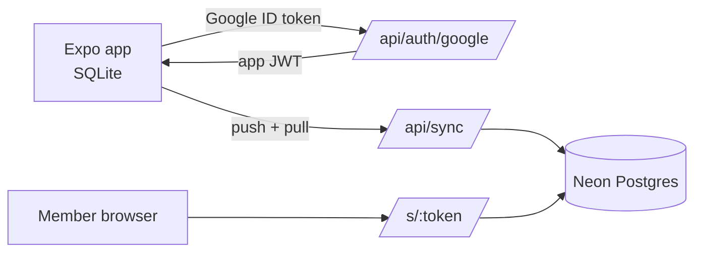

# AllSquare — PRD

Sep 23, 2026 · @Someone

## Overview

AllSquare is a personal Android app where one person logs all shared expenses for a group, then shares balances with members who never install anything.

**Problem.** Splitwise and Settle Up assume everyone joins and participates. In my groups (trips, weekend cricket, family events, dinners) I handle the money myself, so I need to log everything alone and send people a clear "you owe X" at the end.

**What it is.** Groups of people or families, 3-tap expense logging, flexible splits (per head with family headcounts, per party, exact, shares), settlements, simplified debts, and a shareable card, WhatsApp text and read-only link with a UPI pay button.

### Goals

- Log a typical expense in 3 taps or fewer (amount, payer, save), including offline.
- Families count by headcount (x2, x3) automatically, set once per group.
- One tap to produce a share card image and a WhatsApp message showing who pays whom.
- Members see their own balance and itemised history via a link, with no login.
- Match Splitwise Pro and Settle Up Premium features over later phases, with no ads or limits.
- Two users (me and my brother) with fully separate data.

### Non-goals

- Members logging in, editing, or adding expenses.
- Play Store release, iOS, or a web app for the owner.
- Automatic WhatsApp sending (needs the paid Business API).
- Moving real money; UPI links only hand off to the member's UPI app.
- Multiple payers on one expense (log two expenses instead).

## Core concepts

Every money figure is stored as whole paise; every person or family in a group is a **party** with a headcount.

| Concept | What it is | Key rules |
| --- | --- | --- |
| Owner | The logged-in Google user (me, or my brother on his own phone) | Owns all data; nothing is shared between owners |
| Member | A person or family I track, reused across groups | Name, optional phone (for WhatsApp), kind = person or family; one member is "me" (is\_self) |
| Family | A member with kind = family, e.g. "Ravi family" | Has named people (Ravi, Priya); settles as one unit: one balance, one payment |
| Group | A trip, cricket group, event or dinner | Has parties, a default split (per head or per party) and a currency |
| Headcount (weight) | How many heads a party counts for in this group | Defaults to the sum of the family's people (adult 1, child e.g. 0.5); can be overridden per group |
| Expense | One payment by one party | Amount, payer, split, optional note, category, date |
| Split | Who owes how much of an expense | Resolved to exact paise per party when saved, never recalculated later |
| Settlement | A payment between two parties ("Vijay paid me 6,500") | Reduces balances; a payment before any expense acts as an advance or kitty |
| Share link | Unguessable URL for a group, a member, or a member within a group | Read-only, revocable, no login |

**Headcount example.** Trip parties: Sanjay family x2, Ravi family x2, Arun, Karthik, Vijay = 7 heads. A 21,000 hotel bill is 3,000 per head, so each family owes 6,000 and each bachelor 3,000.

### Families and people

A family is a member with its own named people, so the share page can say "Ravi family (Ravi, Priya)" and any expense can include only some of them.

- Each person has a weight: adult 1, child 0.5 (editable).
- A family's headcount in a group = sum of its people's weights, unless overridden for that group.
- Per expense, a family can drop to fewer people: untick Priya and Ravi family counts ×1 instead of ×2 for that expense only (e.g. only Ravi went on the boat ride).
- Balances and payments stay per family; the itemised history shows which people were included.

## Features by phase

v1 is the usable core for the next trip; v1.1 and v1.2 add the premium-equivalent features.

### v1 — Core

| Feature | Acceptance criteria |
| --- | --- |
| Google Sign-In | First launch signs in once; app works offline afterwards; brother's data never visible to me |
| Members and families | Add a person or family with name and optional phone; mark kind; reuse across groups |
| Groups with headcounts | Create group, add parties, set headcount per party (default 1, family 2); choose default split |
| Quick add expense | Amount then Save works when I paid and split is the default; last-used group preselected |
| Split types | Per head (weights), per party (each 1), selected parties only, exact amounts, custom shares; percentages = shares summing to 100 |
| Edit and delete | Any expense or settlement editable; delete is soft with Undo toast |
| Settlements | Record "X paid Y" with amount prefilled from balance |
| Balances | Per group and overall per member; positive = owed to them |
| Simplify debts | Toggle between simplified transfers and "everything through me" |
| Share card image | One tap renders the card (see Sharing) and opens the Android share sheet |
| WhatsApp text | Group summary or per-member message; per-member opens wa.me with their number |
| Read-only link + UPI | Live web page per group or member; UPI pay button with amount |
| Offline + sync | All actions work offline; sync on reconnect and app open |

### v1.1 — Everyday polish

| Feature | Acceptance criteria |
| --- | --- |
| Categories | Preset + custom; auto-suggest from note keywords |
| Saved party sets | e.g. "Saturday XI", "Families only"; one tap to select |
| Search and filters | By text, category, payer, date range |
| Charts | Spend by category, by party, by month, per group |
| Recurring expenses | Monthly ground fee etc.; due entries created on app open |
| Export | CSV and PDF per group via share sheet |
| Home-screen widget + shortcuts | "Add to Cricket" from launcher; widget shows overall balance and + button |
| Reminders | Local notification to me with one-tap WhatsApp nudge to the member |
| Kitty / advance | Record upfront contributions; balances show credit |

### v1.2 — Power features

| Feature | Acceptance criteria |
| --- | --- |
| UPI SMS detection | Debit SMS prompts "Split this?" prefilled; credit SMS from a member suggests a settlement |
| Receipt photo | Attach a photo to an expense; stored in Vercel Blob; visible on share page |
| Receipt scan | On-device OCR fills amount and date |
| Itemised split | Line items each with their own parties; rolls up into the expense split |
| Multi-currency | Log in foreign currency; converted to group currency at logging time with the rate saved |
| Import | CSV import from Splitwise / Settle Up exports |

## Screens and fast-logging flow

The common case (I paid, default split) is amount then Save; everything else is one optional tap away.

```mermaid
flowchart LR
  H[Home<br/>groups + overall balance] -->|+| Q[Quick add sheet]
  Q -->|Save| H
  H --> G[Group<br/>Expenses | Balances]
  G --> B[Balances<br/>simplify toggle]
  B -->|Record payment| S[Settlement sheet]
  G -->|Share| SH[Share sheet<br/>card, text, link]
  G --> P[Parties + headcounts]
```

The **+** button opens the quick add sheet from Home or inside a group.

### Quick add sheet

1. Group chip at top, preset to the current or last-used group (tap to change).
2. Amount keypad focused on open. **Tap 1: type amount.**
3. Payer chips, "Me" preselected. **Tap 2 only if someone else paid.**
4. Split line shows the default, e.g. "Per head · 7". Chips: Per head, Per party. Tap the line to open the split editor.
5. Optional note and category chips.
6. **Tap 3: Save.** Toast with Undo. Long-press Save = save and add another.

### Split editor

- Tabs: Per head, Per party, Exact, Shares.
- Party list with checkboxes (deselect for "bachelors only"), headcount steppers on Per head, amount fields on Exact, weight fields on Shares. Family rows expand into people chips; untick someone and that family drops from ×2 to ×1 for this expense only.
- Live footer: "Remaining 0" must be 0 before Save on Exact.
- Saved party sets as chips above the list (v1.1).

### Group screen

- **Expenses tab:** newest first, grouped by day; each row shows note, payer, amount and my share.
- **Balances tab:** each party's net; toggle Simplified / Through me; each transfer row has Record payment.
- **Parties:** add or remove parties, change headcount, set default split. Headcount changes apply to new expenses only.
- **Share button:** Share card, WhatsApp text, Copy link, and per-member WhatsApp buttons.

## Split rules and balance math

All split types reduce to weights, amounts are resolved to paise at save time, and balances are always computed, never stored.

### Resolving a split

| Split type | Weight per selected party |
| --- | --- |
| Per head | Its headcount in the group (1, 2, 2.5 …) |
| Per party | 1 |
| Shares | The number I enter |
| Exact | No weights; amounts entered must sum to the total |

```latex
\text{owed}_i = \text{amount} \times \frac{w_i}{\sum_j w_j}
```

Rounding uses largest remainder: floor every share in paise, then give the leftover paise one at a time to the parties with the largest fractional parts (ties by party order). Shares always sum exactly to the amount. This logic lives in one shared TypeScript module used by the app and the share page.

### Balances

```latex
\text{net}_i = \text{paid}_i - \text{owed}_i + \text{settlements sent}_i - \text{settlements received}_i
```

Positive net means the party is owed money; the nets of a group always sum to 0. Overall balance per member = sum of their nets across groups.

### Settling up

- **Simplified (default):** repeatedly match the largest debtor with the largest creditor and transfer the smaller of the two amounts. At most n−1 transfers.
- **Through me:** every debtor pays me, and I pay every creditor. More transfers, but I stay in control of the cash.
- Settling across groups records one settlement per group so each group stays correct.

### Worked example (trip)

| Expense | Amount | Paid by | Split |
| --- | --- | --- | --- |
| Hotel | 21,000 | Sanjay | Per head (7) |
| Cabs | 7,000 | Ravi | Per head (7) |
| Food | 10,500 | Arun | Per head (7) |
| Drinks | 3,000 | Karthik | Arun, Karthik, Vijay only |

Result: Sanjay family +10,000, Ravi family −4,000, Arun +4,000, Karthik −3,500, Vijay −6,500. Simplified: Vijay → Sanjay 6,500; Ravi family → Arun 4,000; Karthik → Sanjay 3,500. Use this as a unit test fixture.

## Sharing

Three outputs, all generated from the same balance data: a share card image, WhatsApp text, and a live read-only web page with a UPI button.

### Share card image

&#91;image: AllSquare share card mockup, Midnight Mint\]

- Rendered on the phone from a React Native view (react-native-view-shot), shared via expo-sharing. No backend needed.
- Contents: group name and dates, party and people count; total spent, average per head, number of payments; table of party, headcount badge, share, paid, balance (green positive, red negative); settle-up transfers; my UPI ID and the short link.
- Follows the Simplified / Through me toggle (default: Simplified). Width 1080 px, height grows with party count; above \~10 parties, collapse the table to balance only.

### WhatsApp text

Group summary (plain text so it reads well in any chat):

```
Coorg Trip — settle up
Total ₹41,500 · 7 people

Vijay → Sanjay ₹6,500
Ravi family → Arun ₹4,000
Karthik → Sanjay ₹3,500

Details: https://<app>.vercel.app/s/k3F9...
```

Per-member message opens `https://wa.me/91XXXXXXXXXX?text=...` for that member: their balance, who to pay, and their personal link.

### Read-only web page

- URL `/s/<token>`; token = 16 random bytes, base64url, created on the phone.
- Scopes: whole group, one member across all groups, or one member within a group.
- Shows balance, settle-up transfers, itemised history with that member's share of each expense, and settlements.
- Server-rendered HTML, mobile-first, same visual style as the card. Headers: no-store, noindex. Revoked token shows "Link no longer active".
- Open Graph preview image so the link looks good in WhatsApp (v1.1).

### UPI pay button

- On the web page only, because WhatsApp does not make `upi://` links tappable.
- Format: `upi://pay?pa=<vpa>&pn=<name>&am=<amount>&cu=INR&tn=<group name>`.
- Also show the VPA with a copy button, since some UPI apps block person-to-person intent links.
- Appears only when the viewer owes money and their payment goes to me.

## Brand

AllSquare uses the winking-square mark in the Midnight Mint palette, set in Poppins; tagline "I log. You pay. We're all square."

&#91;image: AllSquare brand sheet\]

### Colour tokens

| Token | Light | Dark | Use |
| --- | --- | --- | --- |
| primary | #0B1F3A | #0B1F3A | Headers, icon background, main text (light) |
| accent | #3DDC97 | #3DDC97 | Main buttons, FAB, chips, icon face |
| secondary | #FF6B6B | #FF6B6B | Badges, highlights, illustrations only |
| background | #F3F6FA | #07152A | App background |
| surface | #FFFFFF | #0F2747 | Cards, sheets |
| text | #0B1F3A | #F3F6FA | Body text |
| textMuted | #5B6B82 | #9FB0C6 | Secondary text |
| border | #E2E8F0 | #1E3A5F | Dividers, card borders |
| positive | #0E9F6E | #4ADE80 | + amounts (owed to you) |
| negative | #E03E3E | #F87171 | − amounts (you owe) |

### Rules

- Mint is a fill (buttons, icon, chips), never the colour of a money amount, so it can't be confused with the owed-to-you green.
- Amounts always carry a sign: +₹ owed to you, −₹ you owe.
- Text on mint is always Midnight; coral is decoration only.
- Type: Poppins 800 for headings and amounts, 600 for labels, 400 for body (expo-font / @expo-google-fonts/poppins).

### App assets (brand kit)

| File | Use in app.json |
| --- | --- |
| icon.png (1024, full-bleed) | `expo.icon` |
| adaptive-icon.png (1024, transparent, face in safe zone) | `android.adaptiveIcon.foregroundImage`, `backgroundColor: #0B1F3A` |
| splash-icon.png (1024, transparent) | splash image, `backgroundColor: #0B1F3A` |
| favicon.png (48) | share page favicon |
| logo-mark.svg, wordmark-light.png, wordmark-dark.png | share card, share page header, README |

## Architecture, sync and security

The phone is offline-first with SQLite; a few Vercel functions handle auth, one sync endpoint and the share page; Neon Postgres is the only database.



Members only ever touch the share page; everything else is the owner's phone.

### Stack

| Layer | Choice |
| --- | --- |
| App | React Native + Expo (dev build, not Expo Go), TypeScript, expo-router, expo-sqlite |
| Auth on phone | @react-native-google-signin/google-signin |
| Sharing on phone | react-native-view-shot, expo-sharing, Linking for wa.me |
| Distribution | EAS Build APK profile (sideload); EAS Update for JS-only changes |
| API | Vercel functions in TypeScript: google-auth-library, jose, @neondatabase/serverless, zod |
| Database | Neon Postgres via the Vercel Marketplace |
| Shared code | `shared/` package: split resolver, balance, simplify, formatters (used by app and share page) |

Repo layout: `app/` (Expo), `api/` + `vercel.json` (Vercel), `shared/`, `db/migrations/`.

### Sync design

- IDs are UUIDs generated on the phone; deletes are soft (`deleted_at`).
- Each synced table has `seq`, set from one Postgres sequence by trigger on insert/update. The phone keeps the last `seq` it saw as its cursor.
- Local SQLite mirrors the tables plus a `dirty` flag. Sync = push dirty rows, then pull rows with `seq` greater than the cursor, in one request.
- Splits travel inside their expense and are replaced as a set.
- Conflicts: last write wins (single owner, maybe two devices).
- Triggers: app open, after each save (debounced), and on regaining connectivity.

### Auth and security

- Google ID token verified server-side against the web client ID; Android OAuth client registered with the EAS keystore SHA-1.
- Server then issues its own JWT (about 90 days), so offline use never forces re-login.
- Every table carries `user_id`; child rows reference parents through composite keys `(user_id, id)`, so a row can never attach to another owner's data.
- Upserts only update rows whose `user_id` matches the caller.
- Share tokens are random, revocable, and scoped; share pages are noindex and no-store.
- Secrets (DATABASE\_URL, JWT secret, Google client IDs) live in Vercel environment variables only.

## Data model

Eight v1 tables in Neon Postgres; the phone's SQLite mirrors them without `user_id`. This is migration `001_init.sql`.

```sql
create sequence sync_seq;
create function bump_seq() returns trigger language plpgsql as $$
begin new.seq := nextval('sync_seq'); return new; end $$;

create table users (
  id          uuid primary key default gen_random_uuid(),
  google_sub  text unique not null,
  email       text not null,
  name        text,
  upi_vpa     text,
  created_at  timestamptz not null default now()
);

create table members (
  id          uuid primary key,
  user_id     uuid not null references users(id),
  name        text not null,               -- "Arun" or "Ravi family"
  kind        text not null default 'person' check (kind in ('person','family')),
  phone       text,                        -- E.164, for wa.me
  family_id   uuid,                        -- set on a person who belongs to a family member
  weight      numeric(4,2) not null default 1, -- person weight: adult 1, child 0.5
  is_self     boolean not null default false,
  updated_at  timestamptz not null,
  deleted_at  timestamptz,
  seq         bigint not null,
  unique (user_id, id)
);
create unique index one_self_per_user on members(user_id) where is_self;
alter table members add foreign key (user_id, family_id) references members(user_id, id);

create table groups (
  id            uuid primary key,
  user_id       uuid not null references users(id),
  name          text not null,
  kind          text,                      -- trip|cricket|event|dinner|other
  default_split text not null default 'per_head' check (default_split in ('per_head','per_party')),
  currency      text not null default 'INR',
  starts_on     date,
  ends_on       date,
  archived      boolean not null default false,
  updated_at    timestamptz not null,
  deleted_at    timestamptz,
  seq           bigint not null,
  unique (user_id, id)
);

create table group_members (
  user_id     uuid not null,
  group_id    uuid not null,
  member_id   uuid not null,
  weight      numeric(5,2) check (weight > 0),  -- headcount override; null = sum of family people's weights (or 1)
  sort_order  int not null default 0,
  updated_at  timestamptz not null,
  deleted_at  timestamptz,
  seq         bigint not null,
  primary key (group_id, member_id),
  foreign key (user_id, group_id)  references groups(user_id, id),
  foreign key (user_id, member_id) references members(user_id, id)
);

create table expenses (
  id           uuid primary key,
  user_id      uuid not null,
  group_id     uuid not null,
  paid_by      uuid not null,
  amount_paise bigint not null check (amount_paise > 0),
  split_type   text not null check (split_type in ('per_head','per_party','shares','exact')),
  note         text,
  category     text,
  spent_on     date not null,
  created_at   timestamptz not null,
  updated_at   timestamptz not null,
  deleted_at   timestamptz,
  seq          bigint not null,
  unique (user_id, id),
  foreign key (user_id, group_id) references groups(user_id, id),
  foreign key (user_id, paid_by)  references members(user_id, id)
);

create table expense_splits (             -- synced nested in its expense
  user_id     uuid not null,
  expense_id  uuid not null,
  member_id   uuid not null,
  weight      numeric(8,2),               -- weight used (null for exact)
  people      uuid[],                     -- family people included; null = all
  owed_paise  bigint not null check (owed_paise >= 0),
  primary key (expense_id, member_id),
  foreign key (user_id, expense_id) references expenses(user_id, id) on delete cascade,
  foreign key (user_id, member_id)  references members(user_id, id)
);

create table settlements (
  id           uuid primary key,
  user_id      uuid not null,
  group_id     uuid not null,
  from_member  uuid not null,
  to_member    uuid not null,
  amount_paise bigint not null check (amount_paise > 0),
  note         text,
  paid_on      date not null,
  updated_at   timestamptz not null,
  deleted_at   timestamptz,
  seq          bigint not null,
  check (from_member <> to_member),
  foreign key (user_id, group_id)    references groups(user_id, id),
  foreign key (user_id, from_member) references members(user_id, id),
  foreign key (user_id, to_member)   references members(user_id, id)
);

create table share_links (
  id          uuid primary key,
  user_id     uuid not null references users(id),
  token       text unique not null,
  group_id    uuid,
  member_id   uuid,
  updated_at  timestamptz not null,
  revoked_at  timestamptz,
  seq         bigint not null,
  check (group_id is not null or member_id is not null),
  foreign key (user_id, group_id)  references groups(user_id, id),
  foreign key (user_id, member_id) references members(user_id, id)
);

do $$ declare t text; begin
  foreach t in array array['members','groups','group_members','expenses','settlements','share_links'] loop
    execute format('create trigger %1$s_seq before insert or update on %1$s for each row execute function bump_seq()', t);
    execute format('create index on %1$s (user_id, seq)', t);
  end loop;
end $$;
create index on expenses (group_id) where deleted_at is null;
create index on settlements (group_id) where deleted_at is null;
```

**Later migrations:** `member_presets` (v1.1 saved party sets), `recurring_rules` (v1.1), `attachments` (v1.2 receipt photos, Vercel Blob URLs), `expense_items` + `expense_item_splits` (v1.2 itemised), and `orig_amount`, `orig_currency`, `fx_rate` on `expenses` (v1.2).

## API

Four routes cover v1, because the phone reads and writes locally and only syncs.

| Method + path | Auth | Request | Response |
| --- | --- | --- | --- |
| POST /api/auth/google | none | `{ idToken }` | `{ jwt, user }`; creates user and the "me" member on first login |
| GET /api/me | JWT | — | `{ id, email, name, upi_vpa }` |
| PATCH /api/me | JWT | `{ name?, upi_vpa? }` | updated user |
| POST /api/sync | JWT | `{ since, push }` | `{ cursor, pull }` |
| GET /s/:token | token | — | HTML share page (rewrite to /api/share) |
| GET /s/:token/og.png | token | — | Preview image (v1.1) |

### /api/sync contract

```json
{
  "since": 1042,
  "push": {
    "members": [], "groups": [], "group_members": [],
    "expenses": [{ "id": "…", "amount_paise": 2100000, "splits": [{ "member_id": "…", "weight": 2, "owed_paise": 600000 }] }],
    "settlements": [], "share_links": []
  }
}
```

- Validate with zod; reject expenses whose splits do not sum to `amount_paise`.
- Apply in one transaction, in foreign-key order: members, groups, group\_members, expenses (+ splits), settlements, share\_links.
- Upsert with `on conflict (id) do update … where t.user_id = excluded.user_id`.
- Response `pull` has the same shape, containing every row of this user with `seq > since` (including soft-deleted rows); `cursor` = max seq returned, or `since` if none.
- Errors: 401 bad or expired JWT; 422 validation with the failing row id.

## Milestones and open questions

Build in seven small milestones; each ends with something testable on the phone or in the browser.

| # | Milestone | Done when |
| --- | --- | --- |
| 1 | Monorepo + shared math | `shared/` split, balance and simplify functions pass the trip worked example as a unit test |
| 2 | Database + API | Migration applied on Neon; auth and sync endpoints deployed; sync tested with curl |
| 3 | App shell + sign-in | Dev build APK signs in with Google and stores the JWT |
| 4 | Local data + quick add | Groups, parties, headcounts, quick add and split editor working fully offline |
| 5 | Balances + settlements | Balances tab, simplify toggle, record payment |
| 6 | Sync | Offline edits appear in Neon after reconnect; reinstall restores data |
| 7 | Sharing + release | Share card, WhatsApp text, share page with UPI; APK built on EAS; EAS Update channel live |

### Open questions

- [x] App name: AllSquare (decided).
- [x] Default settle-up mode: decided, Simplified.
- [x] Family members: stored with individual names (decided), see Families and people.
- [ ] Is a Vercel custom domain wanted for shorter share links?
- [ ] Does my brother get his own UPI ID in settings (yes by design) and his own share-card branding?

## Starter prompt

Save this PRD as `docs/PRD.md` in an empty repo, then paste the prompt below into your coding agent (Claude Code or similar). It builds milestones 1–2 and stops for review.

```
You are helping me build "AllSquare", a personal expense-splitting Android app.
The full spec is in docs/PRD.md. Read it completely before writing any code.

Fixed stack (do not substitute anything):
- App: React Native + Expo (dev build, not Expo Go), TypeScript, expo-router,
  expo-sqlite. Android only, APK via EAS Build, OTA via EAS Update.
- Backend: Vercel serverless functions in TypeScript (no Next.js, no Spring).
- DB: Neon Postgres via @neondatabase/serverless. No other database.
- Auth: Google Sign-In on the phone; the API verifies the Google ID token and
  issues its own JWT (jose).

Repo layout: app/, api/ (+ vercel.json at root), shared/, db/migrations/, docs/.
Brand: put the brand kit files in app/assets/ and use the colour tokens from the
PRD Brand section (as a theme.ts shared by app and share page).

Rules:
- Money is always integer paise. Never floats for money.
- All split/balance/simplify logic lives in shared/ and is pure TypeScript,
  imported by both the app and the API. No duplication.
- Every table has user_id; every query is scoped by the caller's user_id.
- Keep dependencies minimal. Explain any package you add in one line.
- Small commits, one per logical step, with clear messages.

This session: Milestones 1 and 2 only.

Milestone 1 - shared/:
1. resolveSplit(amountPaise, type, parties) for per_head, per_party, shares,
   exact, using largest-remainder rounding so shares sum exactly to the amount.
2. computeBalances(expenses, settlements) -> net paise per member.
3. simplifyDebts(nets) (greedy largest debtor to largest creditor) and
   throughMe(nets, selfId).
4. formatINR(paise) with Indian digit grouping (41,500 / 1,23,456).
5. Vitest tests, including the PRD's trip worked example as a fixture
   (expected: Vijay->Sanjay 6,500; Ravi family->Arun 4,000; Karthik->Sanjay 3,500),
   plus rounding edge cases (100 split 3 ways, weights 2.5).

Milestone 2 - database + API:
1. db/migrations/001_init.sql exactly as in the PRD Data model section,
   plus a tiny script to apply migrations using DATABASE_URL.
2. api/auth/google.ts, api/me.ts, api/sync.ts per the PRD API section:
   zod validation, single transaction, FK-ordered upserts with the
   user_id ownership guard, pull of rows with seq > since.
3. api/share.ts returning a placeholder HTML page for a valid token
   (full design comes in milestone 7) and a vercel.json rewrite /s/:token.
4. .env.example listing every variable; README section on local dev
   with `vercel dev` and how to test sync with curl.

Before coding, reply with: your understanding of the plan in 10 bullets or
fewer, any conflicts or gaps you see in the PRD, and the exact files you will
create. Wait for my OK. After milestone 2, stop and summarise what to test.
```

For later sessions, reuse the same header and replace the last part with the next milestone from the table above.
